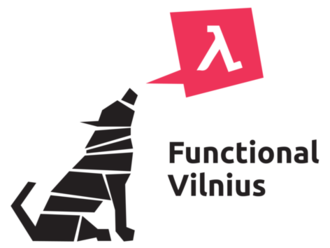

# Palaipsninis tipavimas Pitone:\
   Type Hints ir mypy

*Ignas Vyšniauskas* ([\@yfyf](https://twitter.com/yfyf))

[PyConLT 2015](http://pycon.lt)

2015-02-25

# `/whois yfyf`

. . .

"(Distributed) backend developer"

. . .

--------    ----------------------
  `$$$:`    Erlang, Python
  `❤❤❤:`    Haskell, Rust, Idris
  `???:`    Type Theory, FP, PLT
--------    ----------------------

. . .

[functionalvilnius.lt](http://functionalvilnius.lt)




# Įspėjimas:

## Kalba yra apie *Python 3.x*


# Pagrindinė problema

> * Mes mokam rašyti programas kurios daro už mus _viską_:
     + Skraidina raketas
     + Prognozuoja orus
     + Vairuoja mašinas
     + Kompiliuoja deklaratyvų kodą į mašininį
> * Bet...


# Pagrindinė problema

```python
$ cat mismatch.py
def main():
    return "☠" + True

main()
```

. . .

Nėra _jokio_ konteksto kuriame šita programa būtų prasminga, tačiau...

. . .

```bash
$ python3 -mcompileall mismatch.py; echo $?
Compiling 'mismatch.py'...
0
$ pyflakes3 mismatch.py; echo $?
0
```

. . .

Dabar yra 2015 metai. Kodėl mes nesugebam parašyti programų, kurios rastų
trivialius bug'us _kitose programose_?

*[Pavyzdys įkvėptas [Bob Ippolito](http://bob.ippoli.to/python-haskell-ep2014/)]*

----------------------


. . .

<h1>No.</h1>

. . .

Mes tikrai galim daugiau.

[(src)](http://gunshowcomic.com/648)

# Daugiau problemų

```python
>>> help(bool)
class bool(int)
<..>
 |  The class bool is a subclass of the class int, and
    ****cannot be subclassed****.
<..>
```

. . .


```python
$ cat subclassing.py
class MegaBool(bool):
    pass
```

. . .

```bash
$ python3 -mcompileall subclassing.py; echo $?
Compiling 'subclassing.py'...
0
$ pyflakes3 subclassing.py; echo $?
0
```

----------

<h3>Mano (ne)mėgstamiausia problema (1/2)</h3>

```python
Library     | class UserDB:
code        |     <..>
            |     def user_ids(self):
            |         return [user_id(x) for x in self.users()]
```

. . .

```python
Client      | user_ids = UserDB().user_ids()
code        | if (some_crazy_corner_case): user_ids.sort()
```

. . .


```python
Refactored  | class UserDB:
library     |     <..>
code        |     def user_ids(self):
            |         return map(user_id, self.users())
```

. . .

Klientinis kodas sprogsta:

```python
AttributeError: 'map' object has no attribute 'sort'
```

-----------------------

<h3>Mano (ne)mėgstamiausia problema (2/2)</h3>

> * "Bit-rot": net su 100% code-coverage, bug'as gali likti nepastebėtas labai
    ilgai: kodas veiks visur kur `list`'as tik iteruojamas.
> * Bibliotekos kurėjui sunku trackinti visus API tipus kuriuos jis exposina\
    *"`list` of `user_ids`, or `iterable` of `user_ids`, whatever, maybe doesn't
    quack like a `list`, but still feels like a `list`."*
> * Refaktorinimas yra skausmingas.

. . .

 \
 \
<h3>Statinis tipavimas padeda prižiūrėti kodą.</h3>


# Tipavimas: terminologija


            Statinis tipavimas              Dinaminis tipavimas
                   ||                               ||
                   ||                               ||
                   ||                               ||
            Tipai yra abstrakcijos          Tipai yra tag'ai
                   ||                               ||
                   ||                               ||
                   ||                               ||
            Compile-time checking           Run-time checking


# Pitonistai myli dinaminį tipavimą

* Greitas prototipavimas
* Duck typing
* "Beginner friendly"
* Dirty-hacks-when-needed


# Neapykanta statiniam tipavimui (1/2)

. . .

Pvz. 1:
```C
int intSquare(int a) { return a*a; }
double doubleSquare(double a) { return a*a; }
<..>
```

. . .

```C
#define SQUARE(a) ((a)*(a))
```

Tipavimas C-šeimos kalbose yra visu pirma apie *memory-layout*.


# Neapykanta statiniam tipavimui (2/2)

Pvz. 2:
```Java
private static final int FOO = 5;
```

```Java
List<String> list = new ArrayList<String>();
```

```Java
static List<List<? extends Shape>>
    history = new ArrayList<List<? extends Shape>>();
```

. . .

Yra tam tikrų priežasčių nesimėgauti tokiu kodu.

. . .

Modernios tipų sistemos (pvz. Haskell) turi tokių problemų daug mažiau.


# Išeitis: Palaipsninis Tipavimas\
  (a.k.a. *Gradual Typing*)

"Best of both worlds"

. . .

* Visiškai *opt-in*
* *"Imk tiek statinio tipavimo, kiek pats nori."*
* Liepk kompileriui atsiknist.
* Kalbos ekosistema gali nesikeisti.


# Palaipsninio tipavimo esmė

> 1. (Dinaminės) kalbos "static core" identifikavimas.
> 2. Tipų priskirimas static core.
> 3. "Catch-all" tipas dinaminėm kodo dalim.
> 4. "Draugystė" tarp #2 ir #3
> 5. Kodo anotavimas tipais.
> 6. Tipų tikrinimas _kompiliavimo metu_.


# Truputis istorijos {#hist}

* 2006: *"Gradual typing for functional languages."* (J. G. Siek & W. Taha)
* 2007: Erlang ([Dialyzer](http://learnyousomeerlang.com/dialyzer) 1.7.1), *Success typing*
* 2008: Racket ([Typed Scheme](http://docs.racket-lang.org/ts-guide/)), *Occurance typing*
* 2012: Clojure ([core.typed](http://typedclojure.org/) 0.1)
* 2012: JavaScript ([TypeScript](http://www.typescriptlang.org/))
* 2014: PHP ([Hack](http://hacklang.org/))
* 2014: JavaScript ([Flow](http://flowtype.org/))
* 2014: **Python** ([mypy](http://www.mypy-lang.org/) 0.1.0)
* 2016(?): Ruby? ([Feature #9999](https://bugs.ruby-lang.org/issues/9999))


<!--
# Palaipsninis tipavimas **nėra**:

* Run-time checking
* "Linting"
* Visų kintamųjų anotavimas
* Kiti siaubai
-->


# Pitono kelias link palaipsninio tipavimo

* 1999: Types SIG
* 2006: PEP 3107 (Function Annotations)
* 2013: mypy
* 2015 Sausis: PEP 484 (Type Hints)
* *2015 Rugsėjis: Python 3.5.0 final*, `typing` module


# PEP 3107: Function Annotations

```python
def foo(x, y, z=True):
    <..>
```

. . .

 \
 \

```python
def foo(x: "My favourite argument",
        y: int,
        z: ('a', 'b') = True) -> 42:
    <..>
```

# PEP 484: Type Hints

* *'Python can be statically type checked'* (\*drama\*)
* Function Annotations ---> Type Annotations
* Tipų sistema ir jos sintaksė
* Jokios naujos Pitono sintaksės
* "Stub files"
* Type-checker'iai yra _3rd-party_


# PEP 484 tipų sistema

# Static core of Python

```
>>> import builtins
>>> help(builtins)
<..>
bytearray           memoryview
bytes               property
classmethod         range
complex             reversed
dict                set
enumerate           slice
filter              staticmethod
float               str
frozenset           super
int                 tuple
    bool            type
list                zip
map
```

# Baziniai tipai

```python
def increment(x: int) -> int:
    return x + 1
```

```python
from typing import List

Bone = bytes

class Dog:
    <..>
    def fetch(self) -> Bone:
        <..>

def use_dog_army(dogs: List[Dog]) -> List[Bone]:
    return [dog.fetch() for dog in dogs]
```

# `Any` tipas

## Grubiai:

* `isinstance(x, Any) == True`
* `issubclass(y, Any) == True`
* `isinstance(Any, z) == True`
* `issubclass(Any, z) == True`

 \


```python
$ cat dynamic.py
from typing import Any

def do_magic(dynamic_foo: Any) -> Any:
    bah = dynamic_foo + 1
    <..>
    dynamic_foo.sort()
    baz = dynamic_foo("Haha")
    <..>
$ mypy dynamic.py; echo $?
0
```


# Union tipai


```python
IntOrFloat = Union[int, float]

def square(n: IntOrFloat) -> IntOrFloat:
    return n*n

```

# Generics

```python
T = TypeVar('T')

def reverse(foo: List[T]) -> List[T]:
    return list(reversed(foo))
```

# Constrained TypeVars

```python
T = TypeVar('T', str, bytes)
# (same as T = AnyStr)

def concat(a: T, b: T) -> T:
    return a + b
```

# Stub files

```python
$ cat somemod.py
class Foo:
    def __init__(self, name: str):
        self.name = name
    def talk(self):
        return "Hi, I am %s" % self.name

$ cat somemod.pyi
class Foo:
    name = str
    def __init__(self, name: str) -> None: pass
    def talk(self) -> str: pass
```

# Callable

```python
def map_stupid(f: Callable[[A], B],
               things: Iterable[A]) -> Iterable[B]:
    return (f(x) for x in things)
```


# mypy

* [http://mypy-lang.org/](http://mypy-lang.org/)
* [https://github.com/JukkaL/mypy](https://github.com/JukkaL/mypy)

* Type-checker'is Pitonui
* "Type Hints compatible"
* Nesubrendęs, bet aktyvus
* Partial Python 2 compatibility
* stub'ai 3.x ir 2.7 stdlib


# mypy naudojimas

mypy iš tikrųjų veikia.

1. pip install mypy-lang
2. Naudok.


# mypy naudojimo pavyzdys (1)

```python
$ cat mismatch-ann.py
from typing import Any

def main() -> Any:
    return "☠" + 3

main()
$ mypy mismatch-ann.py
mismatch-ann.py: In function "main":
mismatch-ann.py, line 4:
    Unsupported operand types for + ("str" and "int")
```

# mypy naudojimo pavyzdys (2)

```python
$ cat subclassing.py
class MegaBool(bool):
    pass

$ mypy subclassing.py
subclassing.py, line 1: 'bool' is not a valid base class
```

# mypy naudojimo pavyzdys (3)

```python
    def user_ids(self) -> List[int]:
        return [user_id(x) for x in self.users()]
```

```python
    def user_ids(self) -> List[int]:
        return map(user_id, self.users())

```

. . .


```python
$ mypy lib-client.py
lib-client.py: In member "user_ids" of class "UserDB":
lib-client.py, line 11: Incompatible return value type:
    expected builtins.list[builtins.int],
    got typing.Iterator[builtins.int*]
```

. . .


```python
    def user_ids(self) -> Iterable[int]:
        <..>
def main() -> Any:
    user_ids = UserDB().user_ids()
    if (some_crazy_corner_case): user_ids.sort()
```

. . .


```python
$ mypy lib-client.py
lib-client.py: In function "main":
lib-client.py, line 18: Iterable[int] has no attribute "sort"
```

# mypy coverage

```
$ mypy --html-report dir
```

# Dalykai kurių nespėjom aptarti:

* Stubgen
* Kiti palaipsninių tipų panaudojimai:
    + Dokumentacija
    + Performance optimisations
    + Type-driven design
    + Safe coercions
    + Clean overloading
    + Run-time contract checking
* Structural subtyping

# Išvados

* Type Hints ir mypy galima pradėti naudoti jau šiandien!
* Palaipsninis tipavimas _tikrai_ padės jums rasti bug'us greičiau.
* Ateitis: mypy integruotas į Pitoną?

# Klausimai?

# References (1/2)

* [PEP 483 (Theory of gradual typing)](https://www.python.org/dev/peps/pep-0483/)
* [PEP 484 (Type Hints)](https://www.python.org/dev/peps/pep-0484/)
* [PEP 484 discussion](https://groups.google.com/forum/#!topic/python-ideas/Aa_7lf4jZ7w[1-25])
* [GH repo for prototype `typing` module](https://github.com/ambv/typehinting)
* [mypy web](http://mypy-lang.org/) and [repo](https://github.com/JukkaL/mypy)
* [mypy wiki](http://www.mypy-lang.org/wiki/)
* [mypy type checker info](http://www.mypy-lang.org/wiki/TypeChecker)
* [mypy generics](http://mypy.readthedocs.org/en/latest/generics.html)
* [What is gradual typing](http://wphomes.soic.indiana.edu/jsiek/what-is-gradual-typing/)

# References (2/2)

* [Gradual typing bibliography](https://github.com/samth/gradual-typing-bib)
* [Google pytype](https://github.com/google/pytype/)
* [typeannotations](https://github.com/ceronman/typeannotations)
* [stubgen](https://github.com/ashleyh/mypy-stubgen)
* [mypy-stubgen](https://github.com/JukkaL/mypy/blob/master/mypy/stubgen.py)
* [types SIG](https://www.python.org/community/sigs/retired/types-sig/)
* [GvR on Type Hints @ PyCon2015](http://www.youtube.com/watch?v=2wDvzy6Hgxg)
* [Bob Ippolito @ EuroPython 2014](https://www.youtube.com/watch?v=pJOmlFf5Je4)

